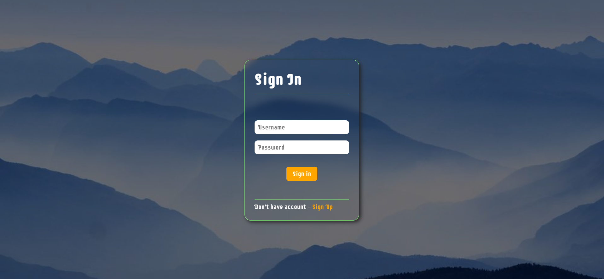

# Advanced-Expense-Tracker
# Created with ReactJs, scss, Socket.io, react-toastify, react-icons.

see a live demo [here](https://income144.netlify.app/)

## Setup and run
* Make sure you have port 3000 and 3001 free in your machine.
* Run `npm i` in both /server and /client directories.
* Replace all `https://income2112144.herokuapp.com/` with `http://localhost:3001` in /client files like Home.js and User.js
* Replace all `https://income144.netlify.app/` with `http://localhost:3000` in /server files i.e server.js
* Open two terminal windows and navigate to both of these directories and run `npm start` in client and `nodemon index.js` in server.

## Refrences
* React - https://reactjs.org/
* scss - https://sass-lang.com/
* Socket.io - https://socket.io/
* React-toastify - https://www.npmjs.com/package/react-toastify
* React-icons - https://react-icons.github.io/
